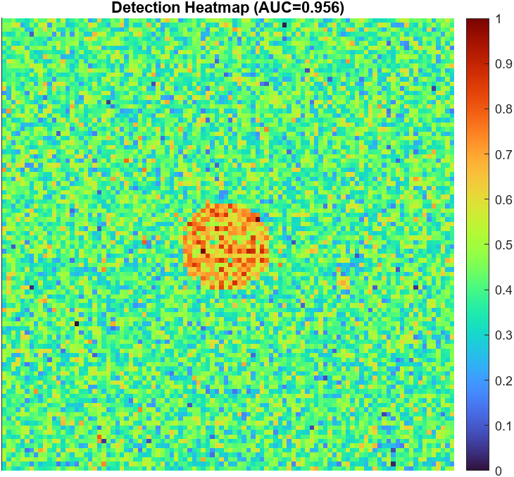
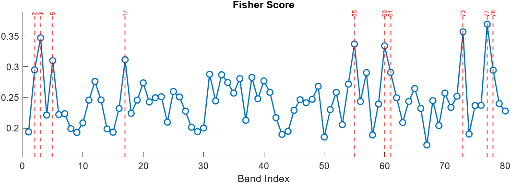
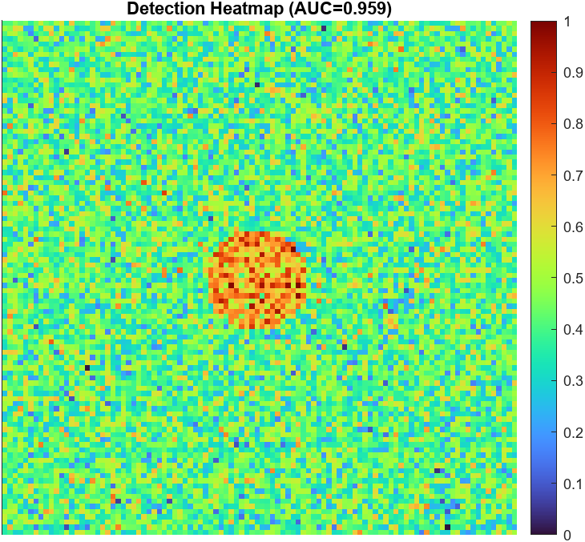
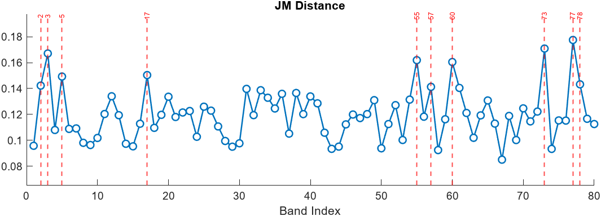
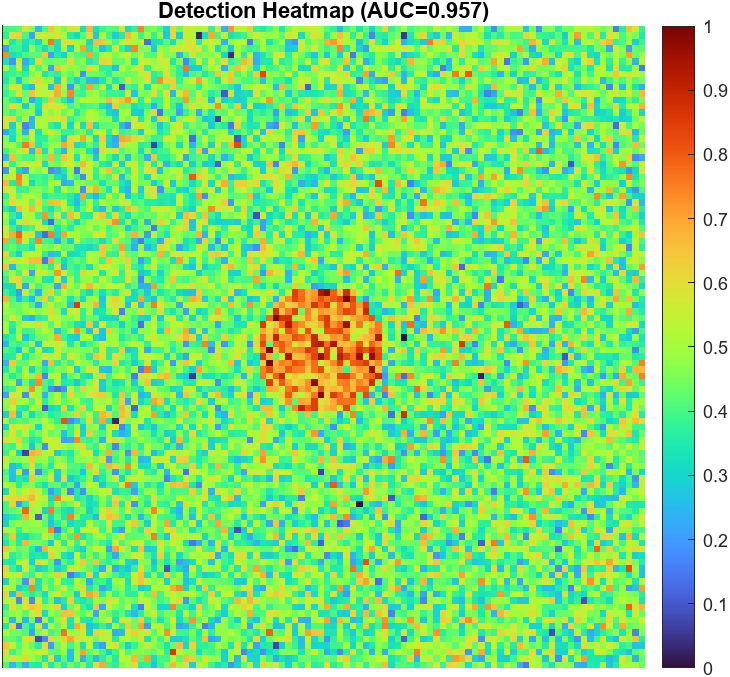
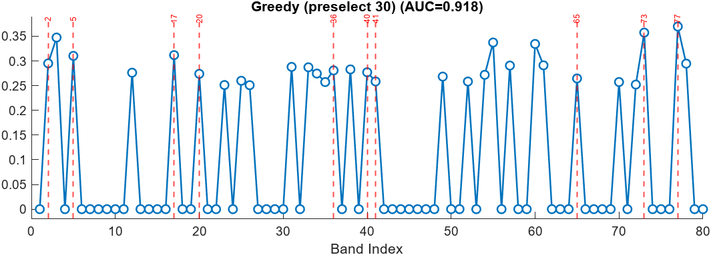
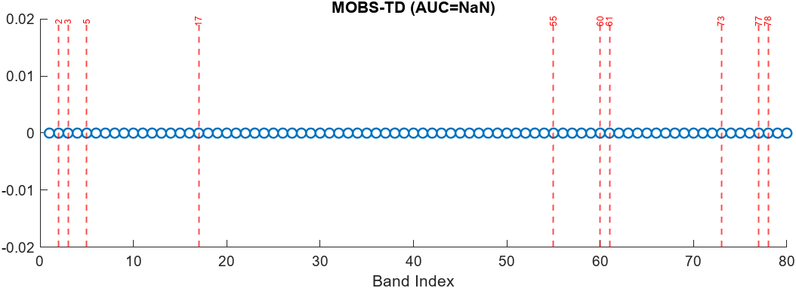

# 🛸 SpectralSentinel

### *Defense-Oriented Hyperspectral Band Optimization and Camouflage Target Detection Framework*

<p align="center">
  
  
  
  
</p>

---

## 🔖 Table of Contents

1. [Author Details](#-author-and-academic-details)
2. [Overview](#-overview)
3. [Motivation](#-motivation)
4. [Key Features](#-key-features)
5. [Graphical User Interface (GUI)](#-graphical-user-interface-gui)
6. [Usage Guide](#%EF%B8%8F-usage-guide)
7. [Example Outputs](#-example-outputs)
8. [Algorithm Summary](#-algorithm-summary)
9. [MOBS-TD — Theoretical Background](#-mobs-td--theoretical-background)
10. [Repository Structure](#-repository-structure)
11. [Performance Summary](#-performance-summary)
12. [Future Scope](#-future-scope)
13. [References](#-references)
14. [License](#-license)
15. [Repository Link](#-repository-link)

---

## 👨‍🎓 Author and Academic Details

| **Name**        | Veda Prakash Mohanarangan                                    |
| --------------- | ------------------------------------------------------------ |
| **Roll Number** | 252SP031                                                     |
| **Programme**   | M.Tech – Signal Processing and Machine Learning (SPML)       |
| **Department**  | Electronics and Communication Engineering (ECE)              |
| **Institution** | National Institute of Technology Karnataka (NITK), Surathkal |
| **Course**      | EC861 – Image Processing and Computer Vision                 |
| **Guide**       | Prof. Amareswararao Kavuri                                   |
| **Date**        | November 2025                                                |

---

## 📘 Overview

**SpectralSentinel** is a MATLAB-based research and visualization framework for **hyperspectral band optimization**, focusing on **defense-oriented camouflage target detection**.

It unifies **four algorithms** into one control interface — the **Hyperspectral Control Room GUI**:

* Fisher Criterion
* Jeffries–Matusita (JM) Distance
* Greedy Band Selection
* MOBS-TD (Multiobjective Band Selection for Target Detection)

The system optimizes **spectral separability**, controls **redundancy**, and automates **data export and visualization**.

---

## 🦭 Motivation

Conventional imaging systems (RGB/MSI) often fail under camouflage or subtle spectral variations.
Hyperspectral imaging (HSI) captures rich spectral detail but introduces **data redundancy and computational load**.

**SpectralSentinel** bridges this gap by:

* Selecting **high-information spectral bands**.
* Reducing **redundancy and noise**.
* Maximizing **class separability and detection reliability**.
* Supporting **defense-grade real-time deployment**.

---

## ⚙️ Key Features

* 🖥️ **MATLAB GUI – Hyperspectral Control Room**
* 🔬 **Integrated Algorithms:** Fisher, JM, Greedy, MOBS-TD
* 🔧 **Configurable Parameters**

  * SNR: 5–40 dB
  * Spectral Shift: −0.2 → 0.2
  * Band Count (`k`)
  * Preselection Count (`m`)
* 📊 **Live Visualization:** Heatmaps, band importance plots, Pareto fronts
* 🧾 **Auto Export:** `.mat` results & `.png` figures with timestamps
* 💽 **Compatibility:** MATLAB R2021b and later

---

## 🖥️ Graphical User Interface (GUI)

The GUI serves as the unified workspace for configuring experiments, executing algorithms, and visualizing results.

<p align="center">
  
</p>

### 🔹 Interface Components

1. Algorithm Selector – Fisher / JM / Greedy / MOBS-TD
2. Sliders – Control SNR and spectral shift
3. Input Fields – Total Bands (B), Select (k), Preselect (m)
4. Run Analysis – Execute chosen algorithm
5. Heatmap Panel – Detection visualization
6. Band Score Panel – Band importance ranking
7. Pareto Plot – Optimization trade-offs
8. Log Console – Runtime information

---

## ▶️ Usage Guide

<details>
<summary><b>Click to Expand</b></summary>

### **Step 1 — Clone the Repository**

```bash
git clone https://github.com/VedaPrakashM/SpectralSentinel.git
cd SpectralSentinel
```

### **Step 2 — Add Project to MATLAB Path**

```matlab
addpath(genpath(pwd));
```

### **Step 3 — Launch the GUI**

```matlab
control_room_matlab
```

### **Step 4 — Configure Parameters**

| Parameter     | Example Value    |
| ------------- | ---------------- |
| Algorithm     | MOBS-TD (MATLAB) |
| Total Bands   | 80               |
| Select (k)    | 10               |
| Preselect (m) | 30               |
| SNR           | 20 dB            |
| Shift         | 0.05             |

Click **Run Analysis** to start.

### **Step 5 — Output Files**

All results are timestamped, for example:

```
MOBS-TD-(MATLAB)_20251108_213419_heatmap.png  
MOBS-TD-(MATLAB)_20251108_213419_bands.png  
MOBS-TD-(MATLAB)_20251108_213419_pareto.png  
figure_combined_MOBS-TD-(MATLAB)_20251108_213419.png
```

</details>

---

## 📊 Example Outputs

| Algorithm             | Visualization Example                                                                                                                                           |
| --------------------- | --------------------------------------------------------------------------------------------------------------------------------------------------------------- |
| **Fisher Criterion**  | <p align="center"> </p>                     |
| **Jeffries–Matusita** | <p align="center"> </p>                             |
| **Greedy Selection**  | <p align="center"> </p>                     |
| **MOBS-TD**           | <p align="center"> </p> |

---

## 🥮 Algorithm Summary

| Algorithm       | Approach                           | Strength               | Limitation                      |
| --------------- | ---------------------------------- | ---------------------- | ------------------------------- |
| **Fisher**      | Variance-based separability        | Fast, simple baseline  | Ignores redundancy              |
| **JM Distance** | Probabilistic divergence           | High separability      | High compute cost               |
| **Greedy**      | AUC-based iterative selection      | Balanced, effective    | Slower on high-dimensional data |
| **MOBS-TD**     | Multiobjective Pareto optimization | Pareto-optimal, robust | High runtime                    |

---

## 🧠 MOBS-TD — Theoretical Background

### Objective Functions

[
\max f_1(X) = \text{Entropy}(X), \quad
\max f_2(X) = \text{Separability}(X), \quad
\min f_3(X) = \text{Redundancy}(X)
]

Each candidate subset
[
X = [b_1, b_2, \dots, b_k]
]
evolves through a **Pareto-based Particle Swarm Optimization (PSO)**.

### Fitness Components

* **Entropy (E):** Information content
* **Redundancy (R):** Penalizes correlated bands
* **Separability (S):** Spectral distinction measure

### Key Metrics

* **WSIS:** Weighted Solution Importance Score
* **MSR:** Mean Spectral Response for subset ranking

---

## 📂 Repository Structure

```
SpectralSentinel/
├── control_room_matlab.m        # GUI Main File
├── main.m                       # MOBS-TD Core Script
├── save_analysis_outputs.m      # Timestamped export
├── fisher_scores.m              # Fisher Criterion
├── jm_distance.m                # JM Distance Computation
├── greedy_selection.m           # Greedy Band Selection
├── simulate_detection.m         # Detection Simulation
├── helper_functions/            # Utility and Plot Scripts
├── results/                     # Auto-saved Figures & Data
├── report/                      # LaTeX Report Files
└── README.md                    # Documentation
```

---

## 🦾 Performance Summary

| Algorithm   | AUC   | Runtime (s) | Remarks                        |
| ----------- | ----- | ----------- | ------------------------------ |
| Fisher      | 0.956 | 0.8         | Fast, reliable baseline        |
| JM Distance | 0.959 | 1.3         | High separability              |
| Greedy      | 0.918 | 4.2         | Balanced trade-off             |
| MOBS-TD     | 0.956 | 130         | Pareto-optimal, multiobjective |

---

## 🚀 Future Scope

* ⚙️ **FPGA / GPU acceleration** for real-time onboard analysis
* 🚁 **UAV integration** for defense hyperspectral monitoring
* 🤖 **Reinforcement learning** for adaptive band selection
* 🌡️ **Multimodal fusion** (HSI + Thermal + LiDAR)
* 🔐 **Integration with MATLAB/Simulink** for simulation workflows

---

## 📚 References

1. X. Sun *et al.*, “MOBS-TD: Multiobjective Band Selection With Ideal Solution Optimization Strategy for Hyperspectral Target Detection,” *IEEE JSTARS*, 2024.
2. C.-I. Chang, *Hyperspectral Data Exploitation: Theory and Applications*, Wiley, 2007.
3. D. Landgrebe, “Hyperspectral Image Data Analysis,” *IEEE Signal Processing Magazine*, 2002.

---

## 📜 License

This project is released under the **MIT License**.
You may reuse, modify, or extend it for **academic and research purposes** with proper citation.

---

## 🔗 Repository Link

🌐 GitHub: [https://github.com/VedaPrakashM/SpectralSentinel](https://github.com/VedaPrakashM/SpectralSentinel)

---

<p align="center"><b>“SpectralSentinel — Empowering Real-Time Defense Through Spectral Intelligence.”</b></p>
