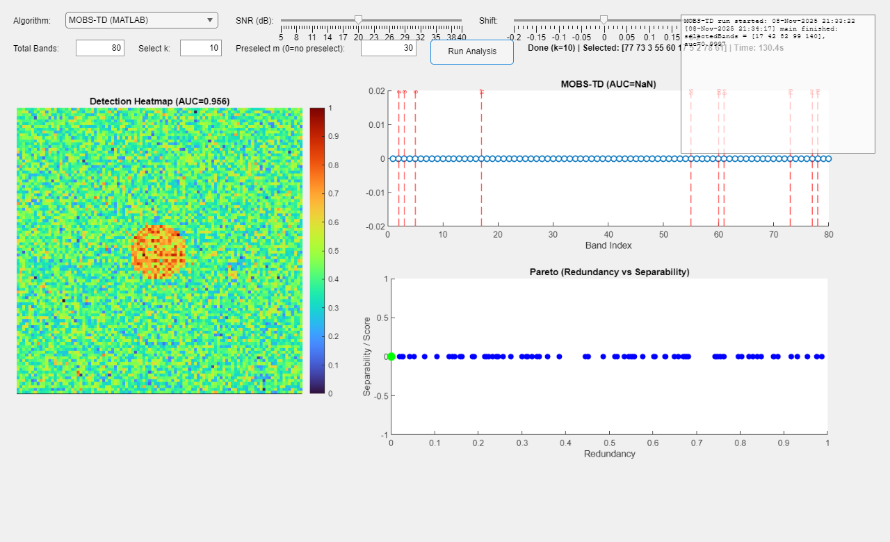

# 🛰️ SpectralSentinel
### *Defense-Oriented Hyperspectral Band Optimization and Camouflage Target Detection Framework*

---

## 🧑‍🎓 Author and Academic Details

**Name:** Veda Prakash Mohanarangan  
**Roll Number:** 22SP2031  
**Programme:** M.Tech – Signal Processing and Machine Learning (SPML)  
**Department:** Electronics and Communication Engineering (ECE)  
**Institution:** National Institute of Technology Karnataka (NITK), Surathkal  
**Course:** EC861 – Image Processing and Computer Vision  
**Guide:** Prof. Amareswararao Kavuri  
**Date:** November 2025  

---

## 📘 Overview

**SpectralSentinel** is a MATLAB-based research and visualization framework for **hyperspectral band optimization** focused on **defense applications** — especially **camouflage and target detection**.  

It integrates four major algorithms into a single interactive GUI, the **Hyperspectral Control Room**:
- Fisher Criterion  
- Jeffries–Matusita (JM) Distance  
- Greedy Band Selection  
- MOBS-TD (Multiobjective Band Selection for Target Detection)

The system helps analyze spectral separability, redundancy, and detection performance through dynamic visualization and automatic report export.

---

## 🧭 Motivation

Traditional RGB or multispectral systems fail under camouflage conditions.  
Hyperspectral imaging captures rich spectral signatures, but large numbers of bands cause redundancy, noise, and computational delay.  

SpectralSentinel addresses this by:
- Selecting the most informative spectral bands.  
- Reducing redundancy while maximizing class separability.  
- Enabling faster, more reliable detection suitable for **defense-grade real-time analysis**.

---

## ⚙️ Key Features

- MATLAB GUI: **Hyperspectral Control Room**
- Supports four band-selection algorithms (Fisher, JM, Greedy, MOBS-TD)
- Adjustable sliders for:
  - SNR (5–40 dB)
  - Spectral Shift (-0.2 to 0.2)
  - Band Count (`k`)
  - Pre-selection count (`m`)
- Real-time progress logs during algorithm execution
- Automatic export of figures and `.mat` files for reproducibility
- Timestamped result storage (e.g., `results_2025-11-08_213419.mat`)
- Compatible with MATLAB R2021b or newer

---

## 🖥️ Graphical User Interface (GUI)

The GUI allows users to configure algorithm parameters, run analyses, and visualize results.

### 🧩 Interface Overview
<p align="center">
  
</p>

### 🔹 Components:
1. **Algorithm Selector** — Choose Fisher, JM, Greedy, or MOBS-TD.  
2. **Sliders** — Adjust SNR and spectral shift.  
3. **Inputs** — Enter total bands (B), selection size (k), and preselect size (m).  
4. **Run Analysis** — Executes selected algorithm and logs progress.  
5. **Heatmap Panel** — Displays target detection intensity.  
6. **Band Scores Panel** — Shows importance ranking of spectral bands.  
7. **Pareto Front Plot** — Plots separability vs redundancy trade-offs.  
8. **Log Console** — Displays runtime events and algorithm status.

---

## ▶️ How to Run

### Step 1: Clone the Repository
```bash
git clone https://github.com/VedaPrakashM/SpectralSentinel.git
cd SpectralSentinel
